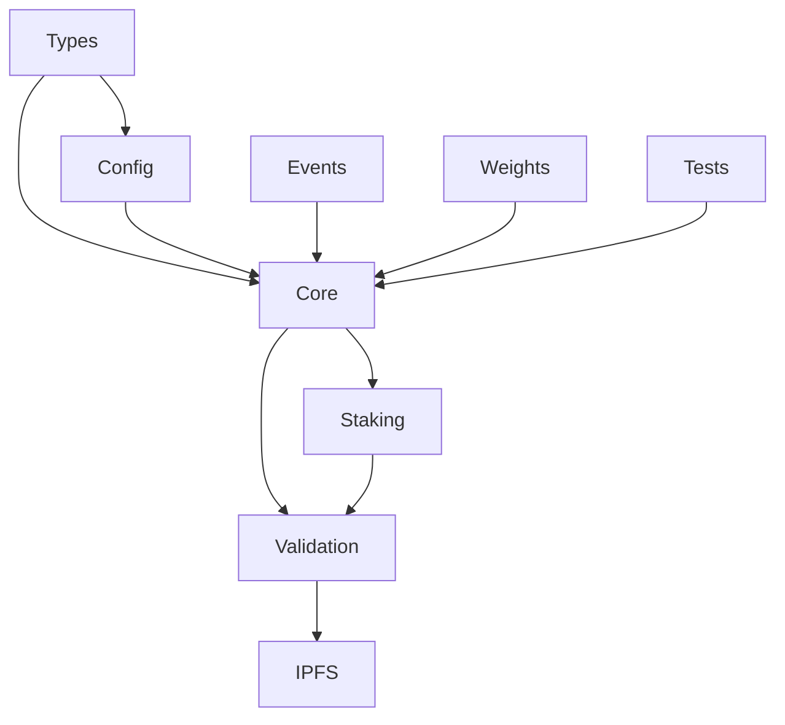

# Module Registrar Pallet Implementation Progress

## Current Status: Core Implementation Complete

### Completed Tasks
- [x] Initial architecture design document
- [x] Core storage structures defined
- [x] Basic extrinsic interfaces designed
- [x] Integration points identified
- [x] Enhanced staking and validation system design
- [x] Validator weight system specification
- [x] Component SPEC files created
- [x] Documentation reorganized into .reference directory
- [x] Pallet basic structure implemented
- [x] Core types and storage items defined
- [x] Weights module created with default implementations
- [x] Core module registration extrinsics implemented
- [x] Module state management system implemented

### Build Priority and Development Plan

#### Phase 1: Foundation (Completed)
1. Types Component
   - [x] Core type definitions
   - [x] Trait implementations
   - [x] Constants and configurations
   - [x] Type conversion utilities

2. Config Component
   - [x] Runtime configuration trait
   - [ ] Genesis configuration
   - [ ] Parameter management system
   - [ ] Storage configuration

3. Core Component
   - [x] Basic pallet structure
   - [x] Storage items defined
   - [x] Module registration logic
   - [x] State management
   - [x] Core extrinsics implementation

#### Phase 2: Validation System (Current Phase)
4. Validation Component
   - [ ] Validator selection system
   - [ ] Performance tracking
   - [ ] Resource monitoring
   - [ ] Result verification

5. IPFS Component
   - [ ] Container storage system
   - [ ] Content retrieval
   - [ ] Garbage collection
   - [ ] Cache management

#### Phase 3: Economic Layer
6. Staking Component
   - [x] Stake types defined
   - [ ] Stake management
   - [ ] Delegation system
   - [ ] Unbonding logic
   - [ ] Reward distribution

7. Events Component
   - [x] Event definitions
   - [x] Event emission system
   - [ ] Event filtering
   - [ ] Historical tracking

#### Phase 4: Performance and Testing
8. Weights Component
   - [x] Basic weight definitions
   - [ ] Weight calculations
   - [ ] Benchmarking system
   - [ ] Performance optimization
   - [ ] Resource tracking

9. Tests Component
   - [ ] Unit test framework
   - [ ] Integration tests
   - [ ] Property tests
   - [ ] Benchmarking tests

### Documentation Structure
```
.reference/
└── module_registrar/
    ├── ARCHITECTURE.md    # High-level design and architecture
    ├── PROGRESS.md        # Implementation progress tracking
    ├── config/
    │   └── SPEC.md       # Configuration component specification
    ├── core/
    │   └── SPEC.md       # Core functionality specification
    └── tests/
        └── SPEC.md       # Testing specifications and requirements
```

### Component Dependencies



### Next Steps
Moving into Phase 2: Validation System implementation. The next component to tackle is the Validator Selection System.
